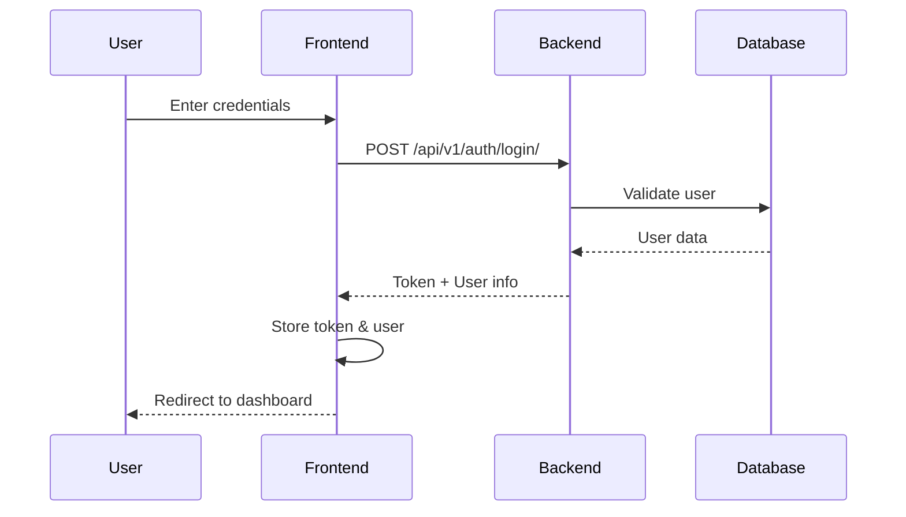
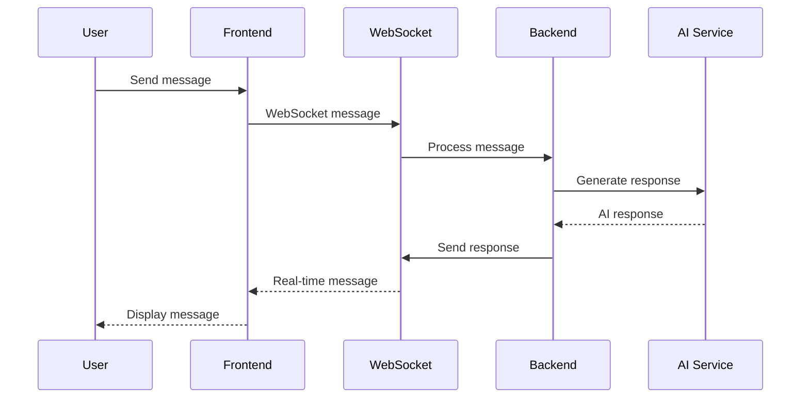

# Elariis Portal with AI Assistant Chatbot

A modern React TypeScript application integrated with a Django backend featuring an AI-powered chatbot assistant for employee portal management.

## 🚀 Features

### Frontend (React TypeScript)
- **Modern UI**: Clean, responsive design with Tailwind CSS
- **Real-time Chat**: WebSocket-powered AI assistant chatbot
- **Authentication**: Secure login/logout with token-based auth
- **Session Management**: Multiple chat sessions with history
- **Employee Portal**: Dashboard with HR, IT, and employee services
- **TypeScript**: Full type safety and excellent developer experience

### Backend (Django)
- **REST API**: Comprehensive API for chat and user management
- **WebSocket Support**: Real-time messaging with Django Channels
- **AI Integration**: OpenAI API integration with intelligent fallbacks
- **User Management**: Extended user profiles with employee data
- **Analytics**: Chat analytics and usage tracking
- **Background Tasks**: Celery for async processing

## 📋 Prerequisites

### Frontend
- Node.js 18+ and npm
- Modern web browser with WebSocket support

### Backend
- Python 3.11+
- PostgreSQL 15+
- Redis 7+
- (Optional) OpenAI API key

## 🛠️ Installation & Setup

### 1. Backend Setup (Django)

```bash
# Navigate to backend directory
cd django_backend

# Create virtual environment
python -m venv venv
source venv/bin/activate  # On Windows: venv\Scripts\activate

# Install dependencies
pip install -r requirements.txt

# Environment configuration
cp .env.example .env
# Edit .env with your database and Redis settings

# Database setup
createdb elariis_chatbot
python manage.py migrate
python manage.py createsuperuser

# Start services
python manage.py runserver  # Terminal 1
celery -A elariis_backend worker -l info  # Terminal 2
```

### 2. Frontend Setup (React)

```bash
# Install dependencies
npm install

# Start development server
npm run dev
```

### 3. Environment Configuration

#### Backend (.env)
```env
SECRET_KEY=your-secret-key-here
DEBUG=True
ALLOWED_HOSTS=localhost,127.0.0.1

DB_NAME=elariis_chatbot
DB_USER=postgres
DB_PASSWORD=your-password
DB_HOST=localhost
DB_PORT=5432

REDIS_URL=redis://localhost:6379
OPENAI_API_KEY=your-openai-api-key  # Optional
```

#### Frontend (API Configuration)
The frontend automatically connects to `http://localhost:8000` for the Django backend. Update the `baseURL` in `src/services/api.ts` if needed.

## 🔧 Integration Steps

### 1. API Service Integration

The `APIService` class handles all backend communication:

```typescript
import { apiService } from './services/api';

// Authentication
await apiService.login(username, password);
await apiService.logout();

// Chat operations
const sessions = await apiService.getChatSessions();
const session = await apiService.createChatSession('New Chat');
await apiService.sendMessage(sessionId, 'Hello AI!');
```

### 2. WebSocket Integration

Real-time chat using WebSocket:

```typescript
import { ChatWebSocket } from './services/websocket';

const ws = new ChatWebSocket(sessionId);
ws.onMessage = (message) => {
  // Handle incoming messages
};
await ws.connect();
ws.sendMessage('Hello!');
```

### 3. React Hooks

Custom hooks for easy state management:

```typescript
// Authentication
const { user, isAuthenticated, login, logout } = useAuth();

// Chat functionality
const { 
  messages, 
  sessions, 
  sendMessage, 
  createSession 
} = useChat();
```

### 4. Component Integration

The main components are ready to use:

```typescript
import ChatBot from './components/ChatBot';
import LoginForm from './components/LoginForm';

// Add to your app
<ChatBot />
<LoginForm onSuccess={() => console.log('Logged in!')} />
```

## 🎯 Usage

### For Users

1. **Login**: Use your employee credentials to access the portal
2. **Chat**: Click the chat button to open the AI assistant
3. **Sessions**: Create multiple chat sessions for different topics
4. **Real-time**: Messages appear instantly via WebSocket connection

### For Developers

1. **API Endpoints**: All endpoints documented in Django backend README
2. **Type Safety**: Full TypeScript types for all API responses
3. **Error Handling**: Comprehensive error handling with user feedback
4. **Extensibility**: Easy to add new features and customize

## 🔐 Authentication Flow



## 💬 Chat Architecture



## 🚀 Deployment

### Frontend (Vite Build)
```bash
npm run build
# Deploy dist/ folder to your hosting service
```

### Backend (Django Production)
```bash
# Collect static files
python manage.py collectstatic

# Use production WSGI/ASGI server
gunicorn elariis_backend.wsgi:application
daphne elariis_backend.asgi:application
```

### Docker Deployment
```bash
cd django_backend
docker-compose up -d
```

## 🔧 Configuration

### API Base URL
Update in `src/services/api.ts`:
```typescript
const api = new APIService('https://your-api-domain.com');
```

### WebSocket URL
Update in `src/services/websocket.ts`:
```typescript
const ws = new ChatWebSocket(sessionId, 'wss://your-websocket-domain.com');
```

### CORS Settings
Backend `settings.py`:
```python
CORS_ALLOWED_ORIGINS = [
    "https://your-frontend-domain.com",
]
```

## 🐛 Troubleshooting

### Common Issues

1. **WebSocket Connection Failed**
   - Check if Redis is running
   - Verify CORS settings
   - Ensure Django Channels is properly configured

2. **Authentication Errors**
   - Check token storage in localStorage
   - Verify API endpoints are accessible
   - Check CORS configuration

3. **Chat Not Working**
   - Ensure user is authenticated
   - Check WebSocket connection status
   - Verify chat session exists

### Debug Mode

Enable debug logging:
```typescript
// In browser console
localStorage.setItem('debug', 'true');
```

## 📚 API Documentation

### Authentication Endpoints
- `POST /api/v1/auth/login/` - User login
- `POST /api/v1/auth/logout/` - User logout
- `GET /api/v1/auth/profile/` - Get user profile

### Chat Endpoints
- `GET /api/v1/chat/sessions/` - List chat sessions
- `POST /api/v1/chat/sessions/` - Create new session
- `POST /api/v1/chat/sessions/{id}/send_message/` - Send message

### WebSocket
- `ws://localhost:8000/ws/chat/{session_id}/` - Real-time chat

## 🤝 Contributing

1. Fork the repository
2. Create a feature branch
3. Make your changes
4. Add tests if applicable
5. Submit a pull request

## 📄 License

This project is licensed under the MIT License.

## 🆘 Support

For support:
- Check the troubleshooting section
- Review the Django backend README for detailed backend information
- Create an issue in the repository
- Contact the development team

---

**Version**: 1.0.0  
**Last Updated**: January 2024